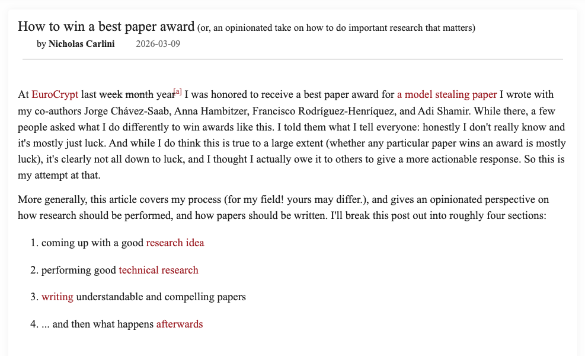

# carlini-dm



A Claude Code skill that turns Nicholas Carlini's research decision-making methodology into a structured framework you can invoke anytime you need to decide what to work on.

Bring one idea or ten. The framework scores each across ten dimensions, eliminates the losers, deep-dives the survivors, and delivers a ranked recommendation with concrete next actions.

Works for research, startups, engineering, product decisions, and general prioritization.

## How it works

You invoke `/carlini-dm` and describe what you're deciding — a single idea, a list of competing options, or an active project you're not sure about.

**For multiple options:** Claude scores each option across all 10 dimensions in a quick elimination round, cuts the bottom half, then deep-dives the top 2-3 survivors before delivering a ranked recommendation.

**For a single idea or active project:** Claude walks through each dimension one at a time and delivers a verdict: Continue, Kill, Pivot, De-risk first, or Practice (craft work).

Either way, you get a direct recommendation and one concrete next action per option.

## The Ten Dimensions

| # | Dimension | What it filters |
|---|-----------|----------------|
| 1 | **Impact** | Does it matter if this succeeds? |
| 2 | **Uniqueness** | Can only you do this, right now? |
| 3 | **Comparative Advantage** | Does this play to your specific strengths? |
| 4 | **Knowledge & Independence** | Do you understand the landscape AND think independently? |
| 5 | **De-risking** | Have you tested the hard part first? |
| 6 | **Collaboration Leverage** | Do you have the right team? |
| 7 | **Timing** | Is the window open? |
| 8 | **Focus** | Can you state this in one sentence? |
| 9 | **Communication Potential** | Can this be explained compellingly? |
| 10 | **Kill / Persist** | Should you stop, continue, or double down? |

> "One excellent paper is worth a thousand mediocre ones, and takes less time to write." — Carlini

## Installation

### Claude Code

```bash
/plugin marketplace add moralespanitz/carlini-dm
/plugin install carlini-dm@carlini-dm
```

### Manual (personal skill)

```bash
git clone https://github.com/moralespanitz/carlini-dm
ln -s $(pwd)/carlini-dm/.claude/skills/carlini-dm ~/.claude/skills/carlini-dm
```

## Usage

```
/carlini-dm
```

Then describe what you're deciding. Examples:

- "I have 5 startup ideas and need to pick one"
- "Should I keep working on this project or kill it?"
- "Help me prioritize these 3 research directions"
- "Is this feature worth building?"

## The Source

Adapted from Nicholas Carlini's article:

**[How to win a best paper award (or, an opinionated take on how to do important research that matters)](https://nicholas.carlini.com/writing/2026/how-to-win-a-best-paper-award.html)** — 2026-03-09

The article covers coming up with good research ideas, executing them well, writing them up clearly, and navigating what happens afterwards. This skill distills the decision-making principles from all four sections into a scoring framework that works beyond academic research.

## Who is Nicholas Carlini?

Nicholas Carlini is a researcher at the intersection of machine learning and computer security, currently at Anthropic. Previously a research scientist at Google Brain (2018–2023) and DeepMind (2023–2025). Ph.D. from UC Berkeley under David Wagner.

His papers have received best paper awards at IEEE S&P, USENIX Security (twice), and ICML (three times), and have been covered by the New York Times, the BBC, Nature, Science, Wired, and Popular Science.

More at [nicholas.carlini.com](https://nicholas.carlini.com).

## Philosophy

- **Taste over throughput** — one excellent decision is worth a hundred mediocre ones
- **Kill fast** — sunk cost is the enemy of impact
- **De-risk first** — test the riskiest assumption before the easiest parts
- **Focus on the distribution** — the outcome is a sample; control what you can control
- **Ideas are cheap** — share freely, execute ruthlessly, collaborate widely

## License

MIT
